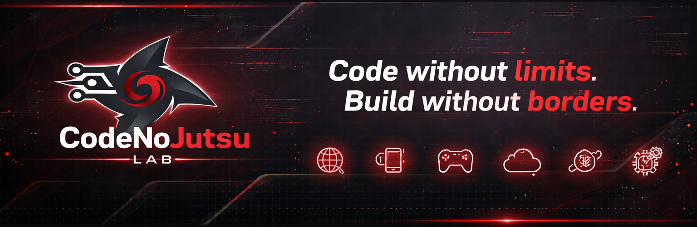

<h2>🥷 CodeNoJutsu Lab</h2>
<i>Code without limits. Build without borders.</i>

	
	
	

A lifelong computer science lab exploring every domain — web, mobile, systems, cloud, AI, and beyond.

## 🧠 About

CodeNoJutsu Lab is a structured GitHub organization dedicated to learning, building, and mastering computer science through real-world projects.

The name comes from a simple idea:  
In the world of _jutsu_, mastery comes from discipline, repetition, and continuous refinement.

That’s how this lab operates.

Every project is a technique.  
Every domain is a new skill.  
Every repo is progress.

---

## 🌍 Vision

CodeNoJutsu Lab is designed to evolve over time into:

- A complete engineering ecosystem
- A public learning platform
- A space where developers build and grow through real systems

> Long-term: Open the lab to others and build together.

---
